# Physical Design Report: Innovus Flow - Academic Project

**Design Block:** `croc_chip`

**Technology:** IHP SG13G2 (130nm)  
**Target Frequency:** 100 MHz (10.0 ns period)  
**Clock Uncertainty:** 0.1 ns  
**EDA Tool:** Cadence Innovus  

---

## 1. Overview and Setup
This report details the physical design (PD) flow for the `croc_chip` design block using the IHP SG13G2 technology node.

Timing constraints are defined in the `constraints.sdc` file, establishing a target frequency of 100 MHz ($T = 10.0$ ns), alongside an uncertainty of 0.1 ns for both setup and hold timing.

**Timing constraints:**
```tcl
set TCK_SYS 10.0
create_clock -name clk_sys -period $TCK_SYS [get_ports clk_i]

set_clock_uncertainty 0.1 -setup [all_clocks]
set_clock_uncertainty 0.1 -hold [all_clocks]
set_clock_transition  0.2 [all_clocks]
```

## 2. Floorplanning (00 & 01)

### 2.1. Core and Die Sizes
The Floorplan stage initializes the core and die dimensions, establishing areas for standard cell placement. A margin of 168 um from the core to the die edge is applied to all four sides to reserve space for I/O rings or pads.

**Floorplan initialization:**
```tcl
floorPlan -site CoreSite -d 1840.32 1840.02 168 168 168 168
```

- **Die Area:** 1840.32 x 1840.02 um
- **Core Area:** Calculated automatically based on the 168 um margins.
- **Target Utilization:** Approximately 58%.

### 2.2. Routing Layer Constraints
The design utilizes metal layers specified in the LEF file. The table below outlines the width, spacing, and pitch specifications for the 7 primary metal layers used for both signal routing and the Power/Ground (PG) mesh.

| Layer | Direction | Pitch (um) | Width (um) | Spacing (um) |
|-------|-----------|----------------|----------------|------------------|
| Metal1 | Vertical | 0.48 | 0.16 | 0.18 |
| Metal2 | Horizontal | 0.42 | 0.20 | 0.22 |
| Metal3 | Vertical | 0.48 | 0.20 | 0.22 |
| Metal4 | Horizontal | 0.42 | 0.20 | 0.22 |
| Metal5 | Vertical | 0.48 | 0.20 | 0.42 |
| TopMetal1 | Horizontal | 2.28 | 1.64 | 1.64 |
| TopMetal2 | Vertical | 4.00 | 2.00 | 2.00 |

### 2.3. Power and Ground (PG) Mesh
The Power/Ground (PG) Mesh is constructed on the upper metal layers to ensure stable power distribution. The PG Mesh is designed to route VDD and VSS through Metal3, Metal4, Metal5, TopMetal1, and TopMetal2. The table below specifies the width, set-to-set distance, and spacing for each metal layer:

| Layer | Direction | Width (um) | Set-to-set (um) | Spacing (um) |
|-------|-----------|----------------|---------------------|------------------|
| Metal3 | Vertical | 1 | 15 | 2 |
| Metal4 | Horizontal | 1 | 15 | 2 |
| Metal5 | Vertical | 1 | 15 | 2 |
| TopMetal1 | Horizontal | 4 | 30 | 4 |
| TopMetal2 | Vertical | 4 | 30 | 4 |

The `addstripe` commands configure the thickness, direction, distances, and interconnecting vias between these layers.

**PG Mesh setup:**
```tcl
# Metal3 (Vertical)
setAddStripeMode -reset
setAddStripeMode -stacked_via_top_layer Metal3 -stacked_via_bottom_layer Metal1 -stapling_nets_style side_to_side
addstripe -layer Metal3 -direction vertical -nets {VDD VSS} -width 1 -set_to_set_distance 15 -spacing 2 -start 0.5

# Metal4 (Horizontal)
setAddStripeMode -reset
setAddStripeMode -stacked_via_top_layer Metal4 -stacked_via_bottom_layer Metal3 -stapling_nets_style side_to_side
addstripe -layer Metal4 -direction horizontal -nets {VDD VSS} -width 1 -set_to_set_distance 15 -spacing 2 -start 0.5

# Metal5 (Vertical)
setAddStripeMode -stacked_via_top_layer Metal5 -stacked_via_bottom_layer Metal4 -stapling_nets_style side_to_side
addstripe -layer Metal5 -direction vertical   -nets {VDD VSS} -width 1 -set_to_set_distance 15 -spacing 2 -start 0.5

# TopMetal1 (Horizontal)
setAddStripeMode -stacked_via_top_layer TopMetal1 -stacked_via_bottom_layer Metal5 -stapling_nets_style side_to_side
addstripe -layer TopMetal1 -direction horizontal -nets {VDD VSS} -width 4 -set_to_set_distance 30 -spacing 4 -start 0.5

# TopMetal2 (Vertical)
setAddStripeMode -stacked_via_top_layer TopMetal2 -stacked_via_bottom_layer TopMetal1 -stapling_nets_style side_to_side
addstripe -layer TopMetal2 -direction vertical   -nets {VDD VSS} -width 4 -set_to_set_distance 30 -spacing 4
```

*(PG Mesh across all upper layers (M3, M4, M5, TM1, TM2))*
<p align="center">
  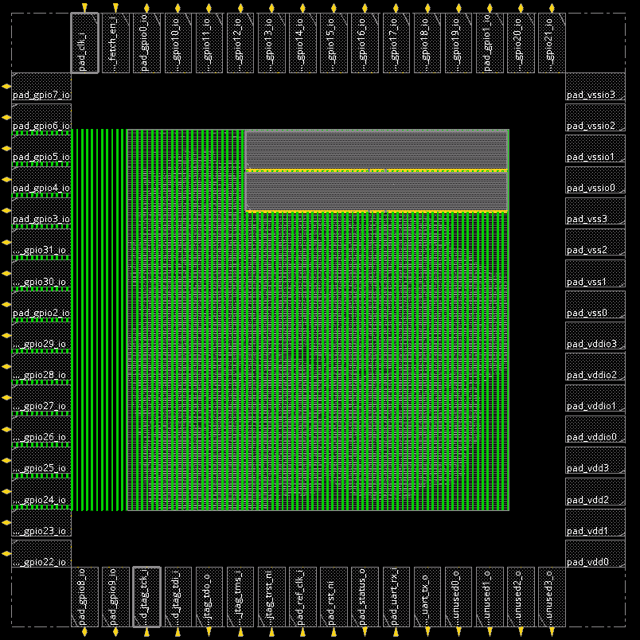
  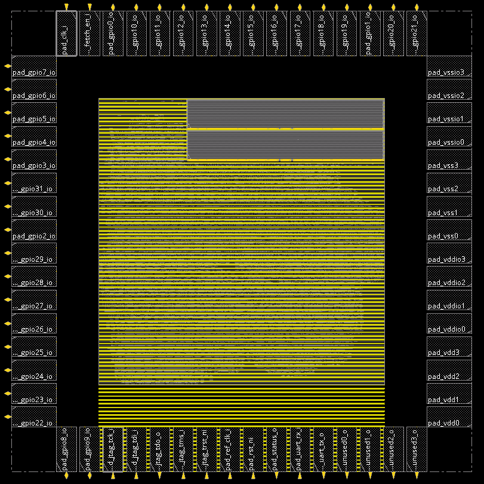
  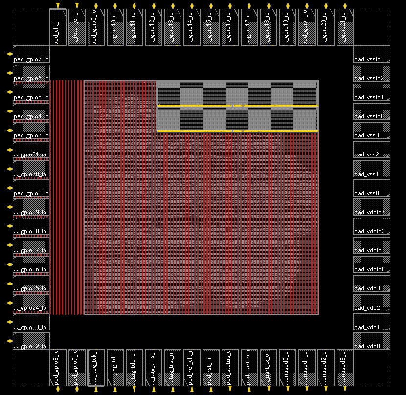
  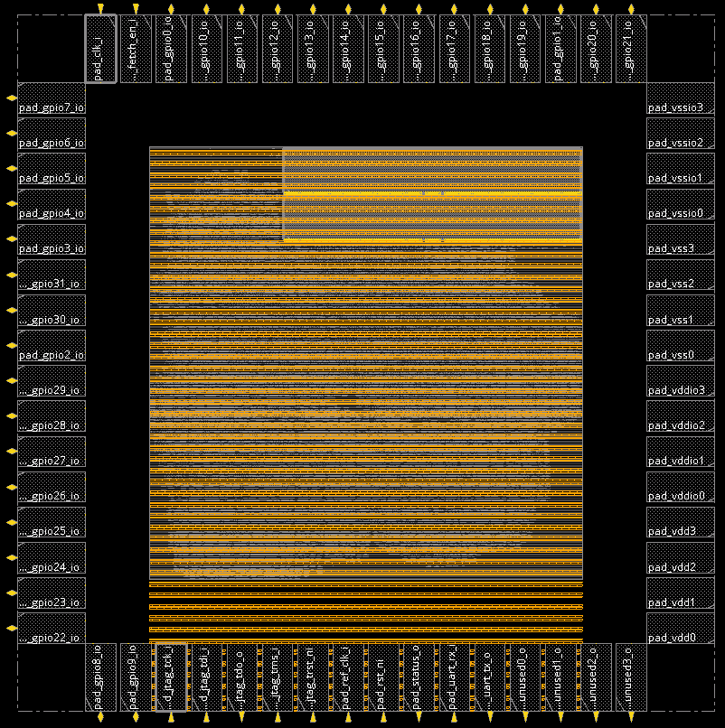
  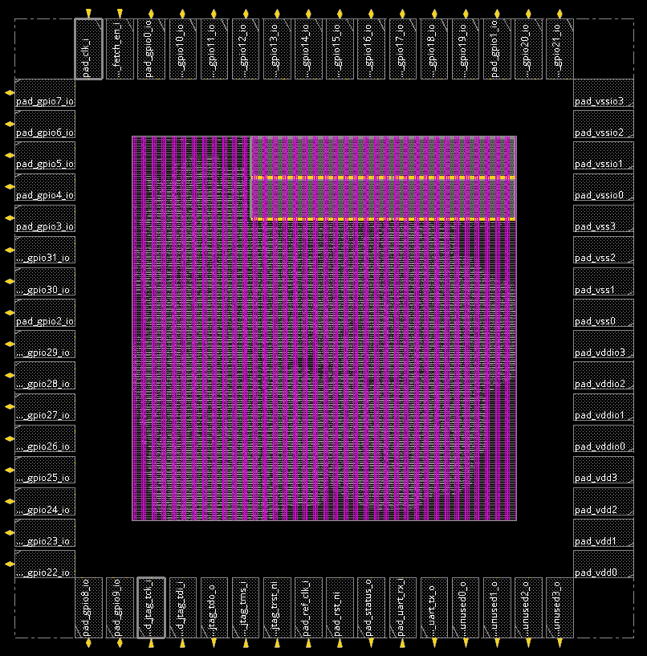
</p>

*(Metal1 Power Rails (left) and Full Floorplan (right))*
<p align="center">
  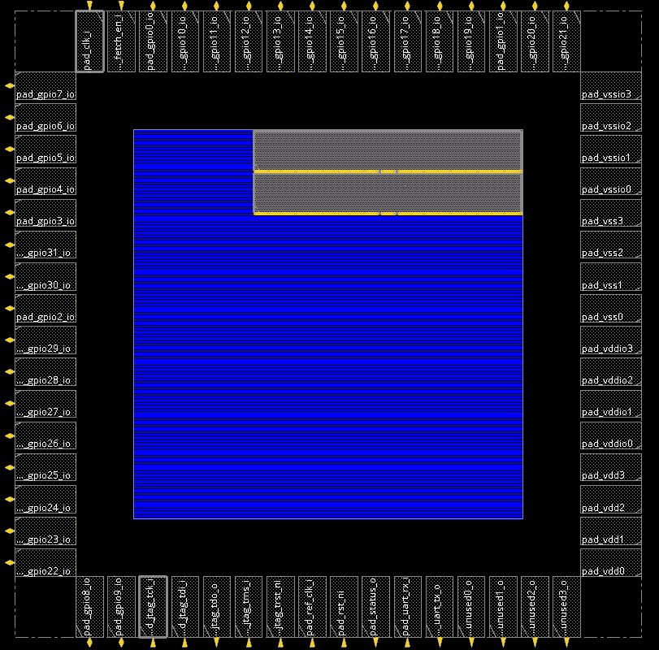
  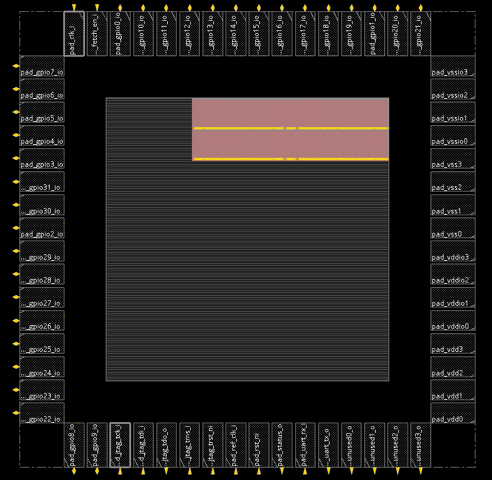
</p>

---

## 3. Placement (02)

The Placement stage maps and positions all standard cells and hierarchical logic blocks into the designated rows. Logic blocks interacting with SRAMs are explicitly placed adjacent to their respective SRAM boundaries to optimize routing and minimize wirelength delays.

**Placement execution and Tie Cells insertion:**
```tcl
place_opt_design

setTieHiLoMode -reset
setTieHiLoMode -cell {sg13g2_tiehi sg13g2_tielo} -maxFanOut 10
addTieHiLo -cell {sg13g2_tiehi sg13g2_tielo} -prefix TIE
```

### 3.1. SRAM and Logic Block Placement
The figures below illustrate the logic blocks (highlighted colored cells) optimally placed near their corresponding SRAM blocks. The SRAM blocks are also encapsulated by placement blockages (Halos) to prevent DRC violations.

*(SRAM placement, adjacent logic cells, and Halo regions)*
<p align="center">
  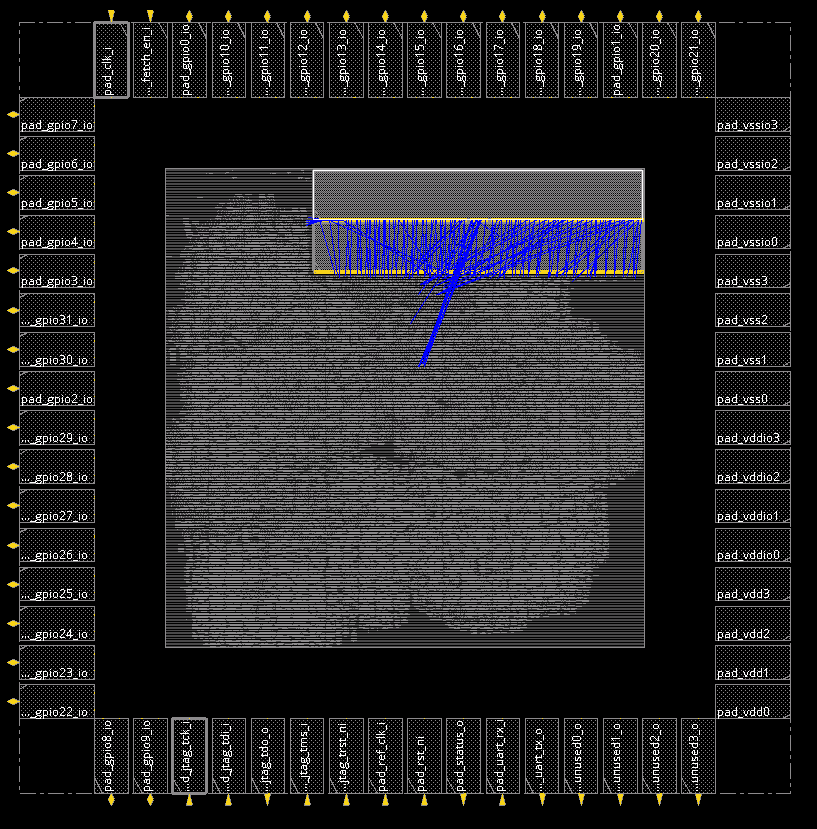
  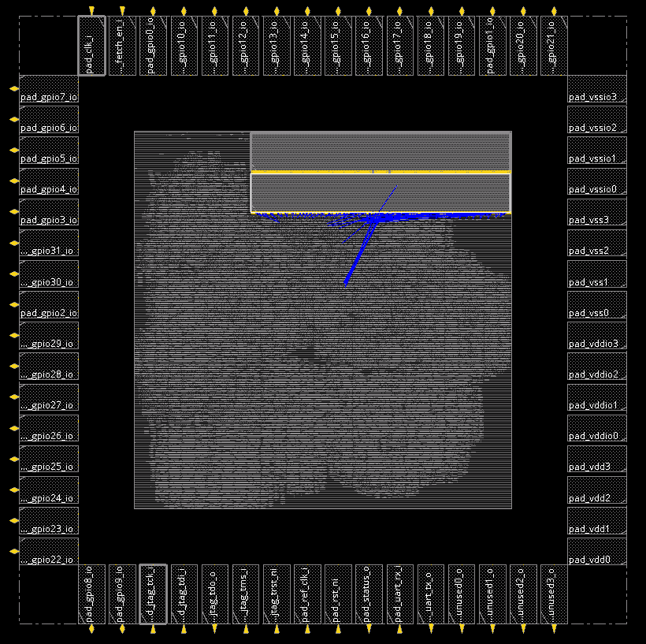
  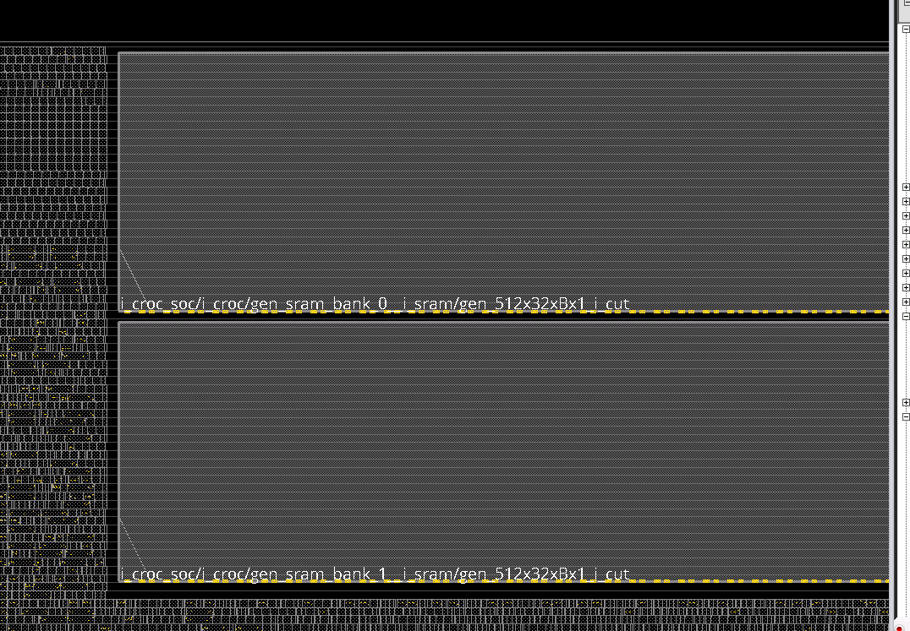
</p>

### 3.2. Redundant Buffer Removal (ECO)
Post-placement timing reports indicated the presence of 9 redundant buffers that negatively impacted the critical paths. These timing violations were manually rectified using ECO (Engineering Change Order) commands by explicitly deleting the redundant instances in batch mode.

**Redundant buffer removal (ECO script):**
```tcl
setEcoMode -batchMode true
ecoDeleteRepeater -inst <ten_instance_buffer_1>
ecoDeleteRepeater -inst <ten_instance_buffer_2>
# ... repeat to remove all 9 redundant buffers ...
setEcoMode -batchMode false
```

*(Full chip overview after Placement)*
<p align="center">
  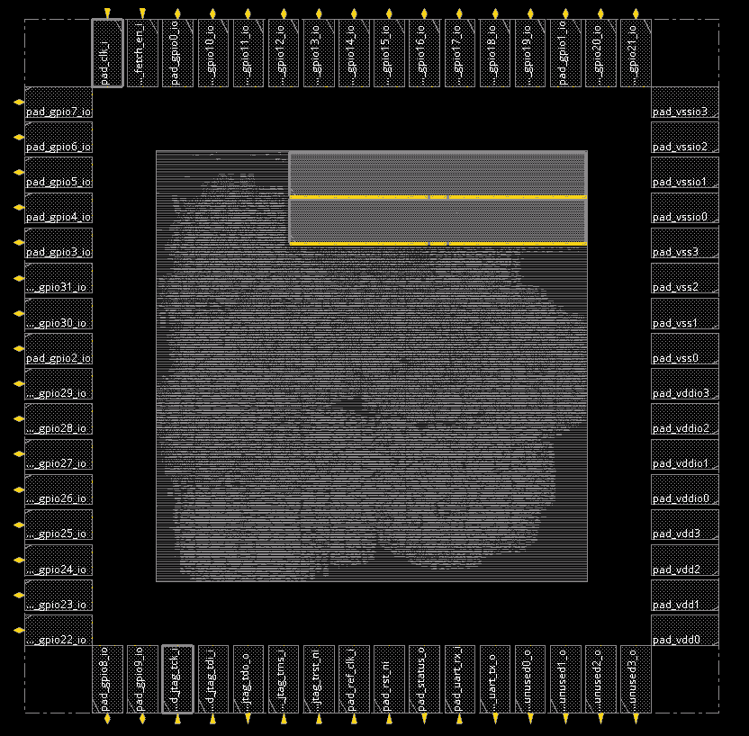
</p>

### 3.3. Post-Placement Timing Report
The table below summarizes the timing results following placement (internal timing paths only). Paths involving I/O ports have been excluded. At this stage, the `reg2reg` path exhibits a slight negative slack (WNS = -0.033 ns).

| Path Type | WNS (ns) | TNS (ns) | Violating Paths (Vio) |
|-----------|----------|----------|-----------------------|
| **reg -> reg** | -0.033 | -0.366 | 33 |
| **reg -> mem** | 0.719 | 0.000 | 0 |
| **mem -> reg** | 0.054 | 0.000 | 0 |

---

## 4. Clock Tree Synthesis (CTS - 03 & 04)

CTS is the phase where the clock distribution network is synthesized to deliver the clock signal to all sequential elements (registers) with minimum skew and balanced latency. The `optDesign -postCTS` command performs further optimization, effectively driving the `reg2reg` timing slack to a positive value.

**CTS Execution and Optimization:**
```tcl
clockDesign -outDir ../rpt/${STAGE}/${STAGE}_clk
optDesign -postCTS
optDesign -postCTS -hold
```

*(Clock Tree Routing visualization)*
<p align="center">
  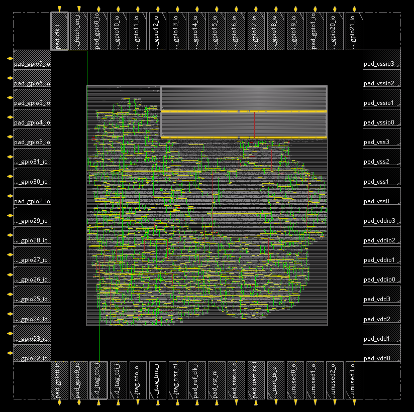
</p>

### 4.1. Post-CTS Timing Report
The results from `optDesign` post-CTS demonstrate successful optimization, as there are no longer any violating paths in the `reg2reg` domain (WNS is positive). Any remaining violations (such as the -2.700 ns WNS seen in the overall summary) are strictly constrained to I/O communications.

| Path Type | WNS (ns) | TNS (ns) | Violating Paths (Vio) |
|-----------|----------|----------|-----------------------|
| **reg -> reg** | 0.001 | 0.000 | 0 |
| **reg -> mem** | 0.638 | 0.000 | 0 |
| **mem -> reg** | 0.044 | 0.000 | 0 |

---

## 5. Routing (05 & 06)

The Innovus NanoRoute engine executes both Global and Detailed Routing. Based on the `config.tcl` specifications, the available routing layers are strictly constrained from `Metal1` up to `Metal5`. This constraint fully dedicates the uppermost layers, `TopMetal1` and `TopMetal2`, to the Power/Ground (PG) Mesh.

**Routing layer constraints:**
```tcl
setDesignMode -topRoutingLayer Metal5
setDesignMode -bottomRoutingLayer Metal1
```

Additionally, the NanoRoute configuration enables timing-driven routing and mitigates signal integrity issues (SI-driven).

**NanoRoute configuration and execution:**
```tcl
setNanoRouteMode -quiet -routeWithTimingDriven 1
setNanoRouteMode -quiet -routeWithSiDriven 1
setNanoRouteMode -routeExpAdvancedPinAccess 2
routeDesign -globalDetail
```

### 5.1. Useful Skew Optimization
To resolve the final timing violations during the post-route stage, **Useful Skew** optimization was enabled in the `optDesign -postRoute` command. Instead of strictly enforcing simultaneous clock arrivals, Useful Skew intentionally advances or delays the clock at specific endpoints, effectively "borrowing" time to compensate for data path delays.

**Useful Skew in Post-Route Optimization:**
```tcl
setOptMode -usefulSkew true
setOptMode -usefulSkewPostRoute true
setOptMode -addInstancePrefix ictc_postRoute_extra_
optDesign -postRoute
optDesign -postRoute -hold
```

### 5.2. Metal Layers and Finishing
The images below illustrate the individual routing metal layers and the insertion of Filler cells to bridge gaps between standard cells, thus preventing DRC well violations.

*(Routing progressively from M1 -> M5 and Vias)*
<p align="center">
  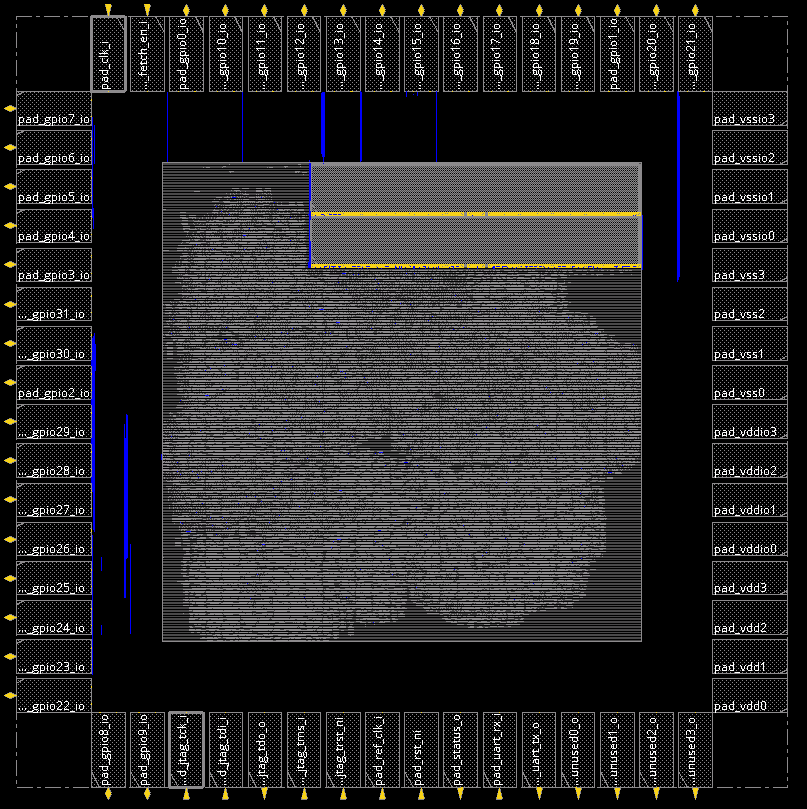
  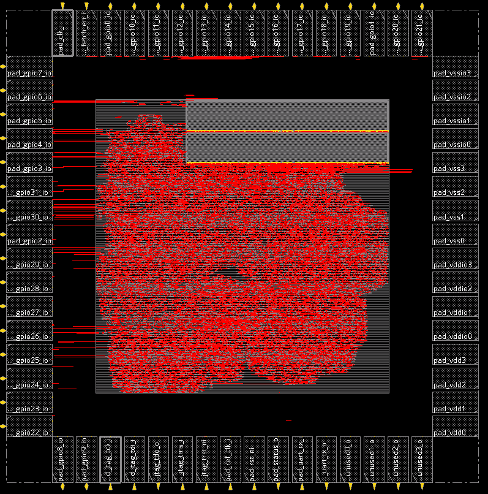
  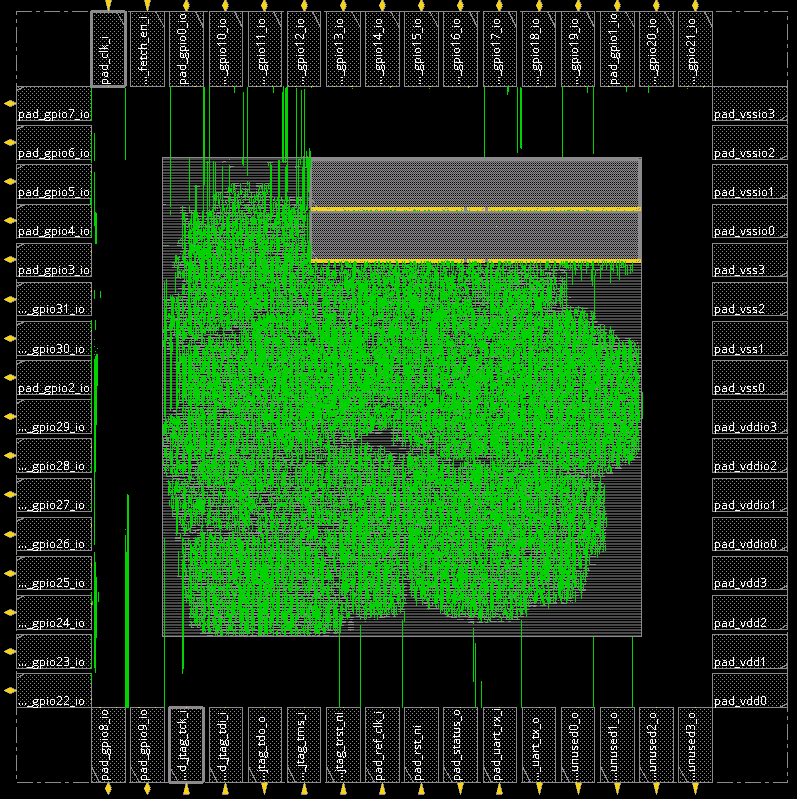
  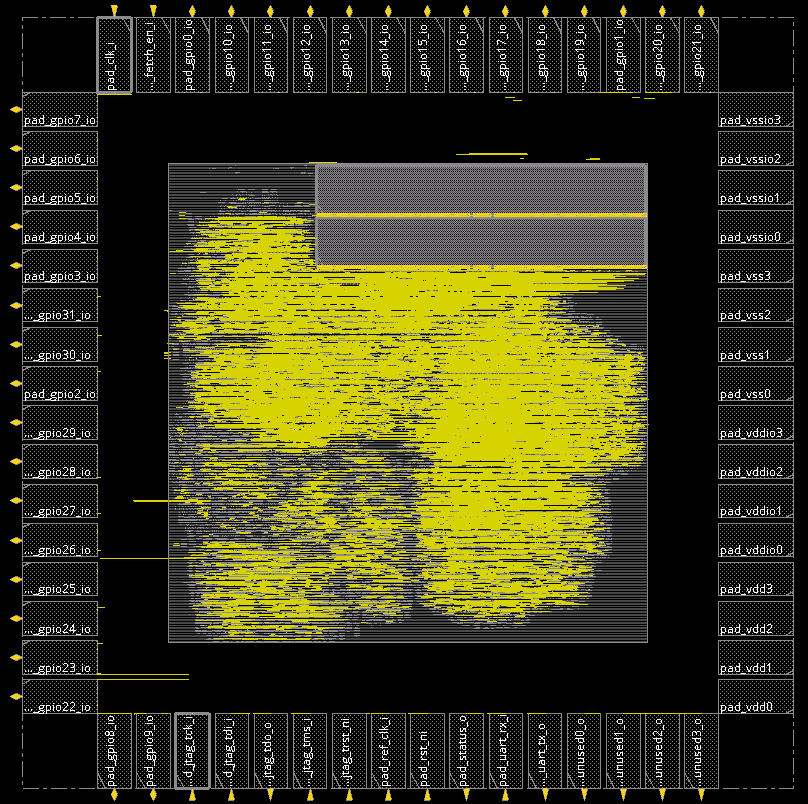
  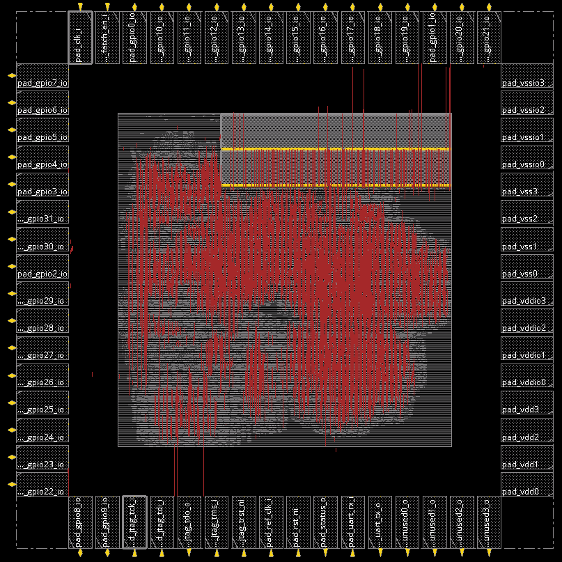
  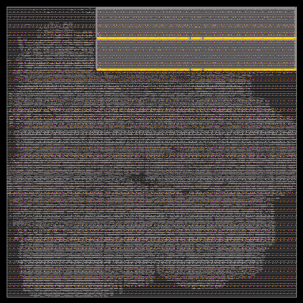
</p>

*(Filler Cells insertion (left) and final chip overview (right))*
<p align="center">
  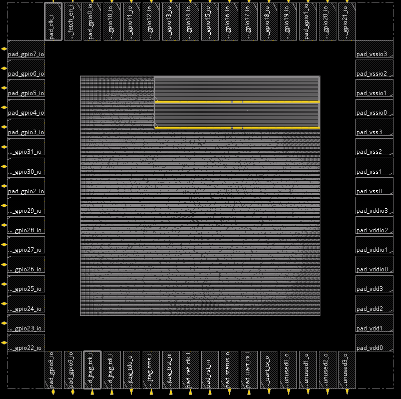
  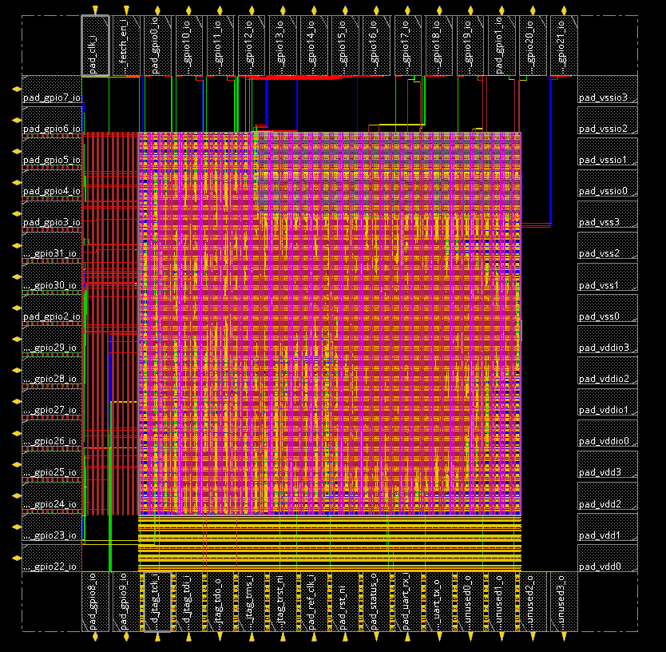
</p>
